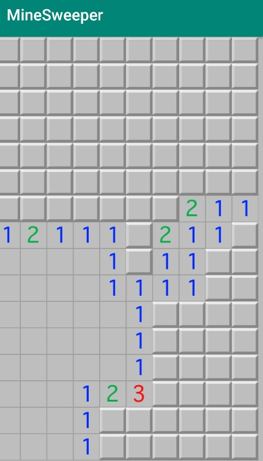

# MineSweeper
MineSweeper

---

2019-05-11
클릭 시 연속된 빈 블록 + 지뢰 인접 블록들 오픈하는 알고리즘  
화면 크기에맞는 셀 배치 구현  
랜덤 지뢰 배치 구현  

2019-05-14
지뢰 선택시 게임 패배, 화면 잠금 구현

## 구현해야할 기능
1. 지뢰 폭팔 애니메이션 구현
2. 버튼을 꾹 누르면, 깃발 설치
3. 화면 상단부에, 타이머와 남은 지뢰 갯수 표시
4. 처음 클릭 시, 지뢰, 인접타일 선택되는 경우가 없도록 구현

## 문제점
객체지향적인 설계가 제대로 갖춰지지 않음, 리팩토링 필요..
