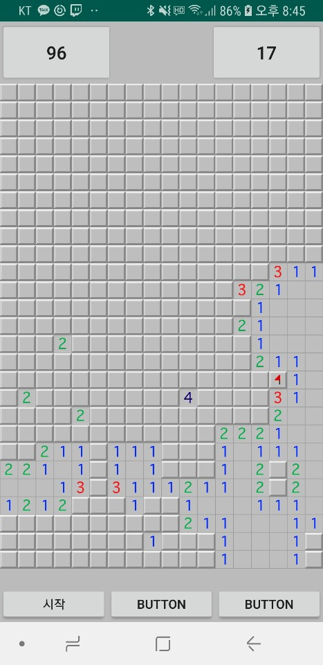

# MineSweeper
MineSweeper

---

2019-05-11
클릭 시 연속된 빈 블록 + 지뢰 인접 블록들 오픈하는 알고리즘  
화면 크기에맞는 셀 배치 구현  
랜덤 지뢰 배치 구현  

2019-05-14
지뢰 선택시 게임 패배, 화면 잠금 구현  

2019-05-21
깃발 설치, 관련 연산 구현  
타이머, 남은 지뢰 갯수 인터페이스 구현  

2019-05-22
대화상자 기능 기초 구현  
셀 사이즈 수정  

## 구현해야할 기능
1. 지뢰 폭팔 애니메이션 
2. 처음 클릭 시, 지뢰, 인접타일 선택되는 경우가 없도록 구현
3. 대화상자를 통한 환경설정 시스템

## 문제점
객체지향적인 설계가 제대로 갖춰지지 않음, 리팩토링 필요..
